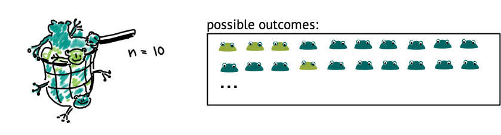

:::::::::::::::::::::::::::::::::::::: questions 

- How can I calculate probabilities in R?

::::::::::::::::::::::::::::::::::::::::::::::::

::::::::::::::::::::::::::::::::::::: objectives

- Demonstrate and practice the use of the base R functions for calculating probabilities. 
- Explain the concept of cumulative distribution.

::::::::::::::::::::::::::::::::::::::::::::::::

Before we look at more distributions, let's get some hands-on experience in R!  
R knows a whole range of distributions:  [Here](https://stat.ethz.ch/R-manual/R-devel/library/stats/html/Distributions.html) is a list of them.

For each distribution, R has four different function calls:
For the binomial distribution, these all end with `binom`:  
- `dbinom`: density   
- `pbinom`: cumulative distribution function (percentage of values smaller than)  
- `qbinom`: quantile function (inverse of cumulative distribution)  
- `rbinom`: generates random numbers

The first letter specifies if we want to look at the density, probability distribution/mass function, quantile or random numbers. The suffix specifies the distribution.

The arguments depend on the distribution we are looking at, but always include the parameters of that function.  

## Calculating probabilities


Let's use the example where we caught 10 frogs and count how many of them are light-colored. 


<p align="center">

</p>

For known parameters, we can calculate the the chances of counting exactly 5 light-colored frogs:

```r
n = 10 # number of frogs we catch
p = 0.3 # true fraction of light frogs
dbinom(x=5, size=n, prob=p)
```

```{.output}
[1] 0.1029193
```

We can ask for the probability of catching at most 5 light frogs. In this case, we need the cumulative probability distribution starting with `p`:


```r
pbinom(q=5, size=n, prob=p) # at most
```

```{.output}
[1] 0.952651
```

Similarly, we can ask for the probability of catching more than 5 light frogs:

```r
pbinom(q=5, size=n,prob=p, lower.tail=FALSE) # larger than
```

```{.output}
[1] 0.04734899
```


Catching at least 5 light frogs is a rare event.


::::::::::::::::::::::::::::::::::::: challenge 

## Challenge: Disease prevalence  

There is a disease with a known prevalence of 4%. You have a group of 100 randomly selected persons. Use the above functions to calculate  

1. the probability of seeing exactly 7 persons with the disease.  
2. the probability of seeing *at least* 7 persons with the disease.


:::::::::::::::::::::::: solution 

1. Exactly 7 persons:

```r
dbinom(x=7,size=100,prob=0.04)
```

```{.output}
[1] 0.05888027
```

2. At least 7 persons:

```r
pbinom(q=6, size=100, prob=0.04, lower.tail=FALSE)
```

```{.output}
[1] 0.1063923
```


:::::::::::::::::::::::::::::::::
:::::::::::::::::::::::::::::::::::


