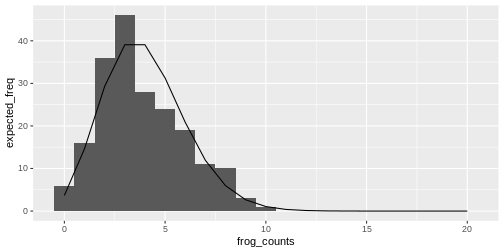
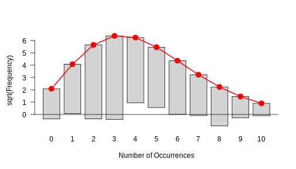

:::::::::::::::::::::::::::::::::::::: questions 

- How can I plot a histogram of my data in R? 
- How can I compare my data to a distribution using histograms?

::::::::::::::::::::::::::::::::::::::::::::::::

::::::::::::::::::::::::::::::::::::: objectives

- Give examples for and practice plotting histograms with `ggplot` and `goodfit`.
- Learn to interpret the results.


::::::::::::::::::::::::::::::::::::::::::::::::


## Start with some data

For demonstration, let's simulate frog counts and sizes with random draws from a Poisson and a Gaussian distribution. This code should by now look familiar to you:


```r
set.seed(51) # set a seed for reproducibility
frog_counts <-rpois(n = 200, lambda = 4)
frog_sizes <- rnorm(n = 200, mean = 7, sd = 2)
frog_counts_different_lakes <- rnbinom(n=200, size=2, mu=4)  
```

## Plotting a histogram
We can then use `ggplot2` to plot histograms from the simulations. The histogram will have a shape that is specific for the distribution:


```r
data.frame(frog_counts) %>% 
  ggplot(aes(x=frog_counts))+
  geom_histogram(binwidth=1)
```


::::::::::::::::::: challenge

## Exercise: Plot your first histogram

Start with the following set-up:


```r
set.seed(51) # set a seed for reproducibility
frog_counts <-rpois(n = 200, lambda = 4)
```

Note how I used `binwidth=1` for displaying the count data. What happens if you don't?

::::::::::::::::::::::::::: solution
An automatic bin-width of 30 is chosen. Decide for yourself whether this gives you a good overview over your data. It's often a good idea to play around with the `binwidth` parameter.
:::::::::::::::::::::::::::::::::
:::::::::::::::::::::::::::::::::


### Relation between histogram and distribution function

The theoretical distribution gives the expected frequency of the random numbers.  

For example for the Poisson frog counts, we can calculate the expected frequency of the counts from 0 to 20:

```r
counts <- 0:20
expected_freq <- dpois(counts, lambda = 4) * length(frog_counts) 
```

Then we can plot the expected counts as a line on top of the histogram:

```r
data.frame(frog_counts) %>% 
  ggplot(aes(x=frog_counts))+
  geom_histogram(binwidth=1)+
  geom_line(data=data.frame(counts,expected_freq), aes(counts,expected_freq))
```




### The `goodfit` function

You might not want to code this plot every time you visually inspect a fit. Luckily, there are convenient functions that do this for you.  

The `goodfit` function from the `vcd` package allows you to fit a sample to a discrete distribution of interest.   
Here, we fit the frog counts to a Poisson:

```r
library(vcd)
my_fit <- goodfit(frog_counts,"poisson")
my_fit$par
```

```{.output}
$lambda
[1] 3.83
```

```r
plot(my_fit)
```



This is how a good fit looks like: The bars all roughly stop at zero, some above and some below, which is due to the sample's randomness.


::::::::::::::::::: challenge

## Exercise: Fit a Poisson distribution


Start with the following set-up:

```r
set.seed(51) # set a seed for reproducibility
frog_counts_different_lakes <- rnbinom(n=200, size=2, mu=4)  
```

Use the `goodfit` function to fit the `frog_counts_different_lakes` data with a Poisson. 

::::::::::::::::::::::::::::


This histogram in the above challenge should show you that there is a systematic problem: The bars at the periphery hang very low and those around the peaks hang high. This indicates that the fit isn't too good.  


:::::::::::::::::::: challenge

## Exercise: Fit a Gamma-Poisson

Start with the following set-up:

```r
set.seed(51) # set a seed for reproducibility
frog_counts_different_lakes <- rnbinom(n=200, size=2, mu=4)  
```

1. Fit the frog counts from different lakes with a Gamma-Poisson distribution instead (hint: in the `goodfit` function, it is called `nbinomial`).  
2. Can you make out the visual difference between a good and a bad fit?  

::::::::::::::::::::::
