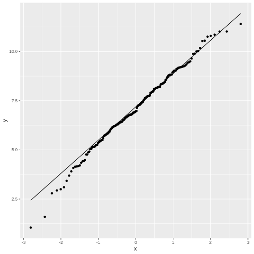
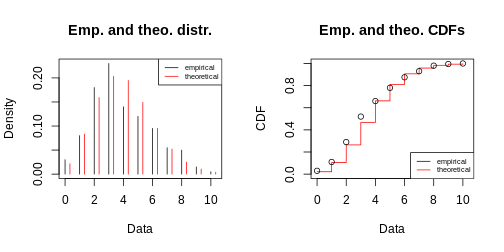

:::::::::::::::::::::::::::::::::::::: questions 

- What is the QQ-plot?
- How can I create a QQ-plot of my data?
- Why is it useful?

::::::::::::::::::::::::::::::::::::::::::::::::

::::::::::::::::::::::::::::::::::::: objectives

- Demonstrate the calculation of quantiles in R.
- Explain the QQ-plot.
- Introduce functions to make a qq-plot in R.

::::::::::::::::::::::::::::::::::::::::::::::::


## The QQ-plot

The qq-plot compares the quantiles of two distributions. 

Quantiles are the inverse of the cumulative distribution, i.e., the `qnorm` function is the inverse of `pnorm`:  

You can use `pnorm` to ask for the probability of seeing a value of $-2$ or smaller:

```r
pnorm(q = -2,mean=0, sd=2) 
```

```{.output}
[1] 0.1586553
```

Then you can use `qnorm` to ask that is the value for which 15% of the other values are smaller. Here, I demonstrate this by plugging the result into the `pnorm` function into the `qnorm` function:

```r
qnorm(p= pnorm(q = -2,mean=0, sd=2), mean=0, sd=2) 
```

```{.output}
[1] -2
```

Let's compare the quantiles of the simulated frog sizes to the theoretical quantiles of a normal distribution.
There are specialized functions for qq-plots, so we don't have to calculate the theoretical values by hand:


```r
data.frame(frog_sizes) %>% 
  ggplot(aes(sample=frog_sizes))+
  geom_qq()+
  geom_qq_line()
```



By default, the `geom_qq` function assumes that we compare to a standard normal distribution.  
This fit doesn't look too bad, although for low values the points stray away from the line. This shouldn't surprise you, because remember: The normal distribution approximates the Poisson distribution (with which the simulation was generated) well for large values, but has limitations for low-valued counts.  

Let's set up a qq-plot where we compare to a Poisson distribution:


```r
data.frame(frog_counts) %>% 
  ggplot(aes(sample=frog_counts))+
  geom_qq(distribution=qpois, dparams=list(lambda=mean(frog_counts)))+
  geom_abline()
```


This fit looks better. We can still argue whether a qq-plot is the best representation for a Poisson fit, because due to the distribution's discreteness, many data points end up on the exact same spot in the plot (overplotting). Thus, we loose information in this visualization.  

## One fits all - `fitdistrplus` package

If you want a quick overview, you can use the `fitdistrplus` package, which produces a series of plots.

Suppose you fit the frog counts to a normal distribution:

```r
library(fitdistrplus)
my_fit <- fitdist(frog_counts, dist = "norm")
my_fit # gives you the parameter estimates
```

```{.output}
Fitting of the distribution ' norm ' by maximum likelihood 
Parameters:
     estimate Std. Error
mean 3.830000  0.1495176
sd   2.114498  0.1057248
```

```r
plot(my_fit)
```


With some practice, this plot quickly allows you to see that you are comparing discrete data to a continuous distribution. Also, the QQ-plot doesn't really give a straight line and the histogram seems to be skewed to the left, compared to theory.

::::::::::::::::::::::::: challenge

What does it look like if you fit the `frog_counts` to a Poisson instead?

Start from this set-up:

```r
set.seed(51) # set a seed for reproducibility
frog_counts <-rpois(n = 200, lambda = 4)
library(fitdistrplus)
```

::::::::::::::::: solution


```r
my_fit <- fitdist(frog_counts, dist = "pois")
plot(my_fit)
```



::::::::::::::::::::::::::::
::::::::::::::::::::::::::::::

