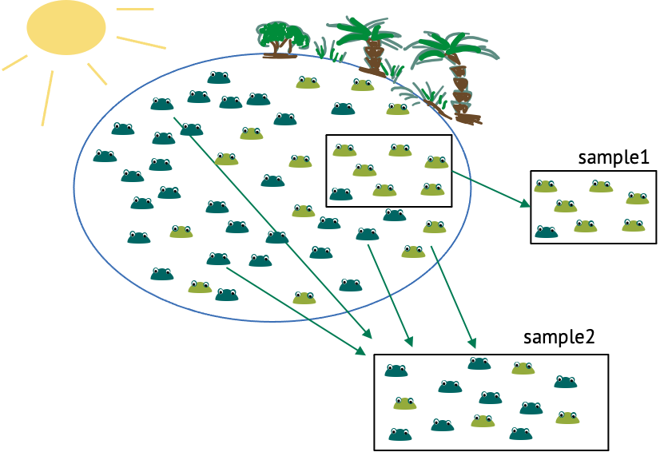

:::::::::::::::::::::::::::::::::::::: questions 

- What is sampling?  
- What requirements should a good sample fulfill?

::::::::::::::::::::::::::::::::::::::::::::::::

::::::::::::::::::::::::::::::::::::: objectives

- Introduce the concept of sampling.

::::::::::::::::::::::::::::::::::::::::::::::::

{width="500px" alt="lake with frogs and two samples drawn from them"}

Let's start with an example, and thereby define some terminology. We have a lake with frogs in it, and there are light and dark green frogs. There’s a sunny side of the lake, and a shadowy area by the trees. Now imagine you want to estimate the fraction of light green frogs in the lake. There are too many frogs to count them all, so you catch a few and count how many of them are light coloured. This is a sample. A **sample** are randomly independently drawn events from a **population of interest**. The population of interest, in this case, are all the frogs in that lake. How can we draw **randomly and independently**? One obvious thing you could randomize in this experiment is the location at which you cath the frogs, because from the above picture you could get the impression that light-coloured frogs gather more in the shadows, while the dark-green frogs like the sun. Therefore, if we caught all the frogs in the same area, like in sample 1, this would probably over-represent light frogs, thus not representing the population well. When randomizing the locations, this is less likely to be the case (see for example sample 2). You get similar problems if the observations are not independent. One example of dependent observations would be if you start with one frog, then catch the one right next to it, and so on. This is also likely to over-represent one colour of frogs, and the reason why observations shouldn’t depend on each other. The **sample size** is the number of frogs in one sample. 

:::::::::::::::::::::::::::::::::::::::::::::::::::::::::::::::::::: instructor

Inline instructor notes can help inform instructors of timing challenges
associated with the lessons. They appear in the "Instructor View"

::::::::::::::::::::::::::::::::::::::::::::::::::::::::::::::::::::::::::::::::

