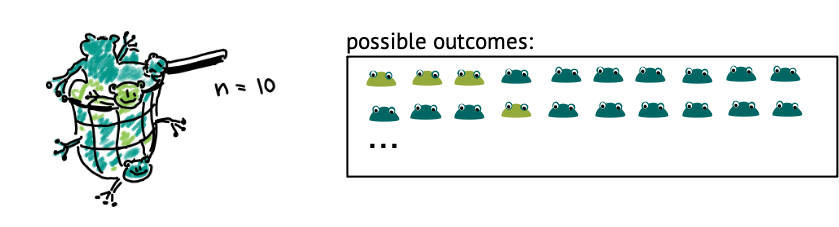

:::::::::::::::::::::::::::::::::::::: questions 

- What is a probability distribution?

::::::::::::::::::::::::::::::::::::::::::::::::

::::::::::::::::::::::::::::::::::::: objectives

- Describe how a probability distribution maps outcomes to probabilities
- Explain the difference between discrete and continuous distributions

::::::::::::::::::::::::::::::::::::::::::::::::

## Overview probability distributions

Most data analyses assume that data comes from some distribution. A probability distribution assigns probabilities to possible outcomes of an experiment. In terms of sampling, even if the sampling is supposed to be random, it doesn't mean that there are no rules -- so one could say that the probability distribution defines the rules for randomness.  

Let's get back to our example of the lake of frogs, which is inhabited by light and dark green frogs. Let's say, the true fraction of light green frogs is $1/3$, and you decide sample of $n=10$ frogs from that lake at random.
Then, if you count the number of light-colored frogs within that net, there are 11 possible outcomes: The number can be between 0 and 10.

Below, you see a plot out of this, where each of these events has a probability. A suitable distribution for describing this scenario is the *binomial distribution*, which assumes a number of trials (frog catches) which can have two outcomes (light, dark).

{width="500px" alt="possible outcomes of sampling ten frogs"}

If the true fraction of light frogs is one third, then the most likely outcome is catching 3 light frogs. Seeing 10 light frogs is rather unlikely: The probability is close to zero, and we would consider this a rare event. 

{width="500px" alt="graph showing probability distribution of frog catches"}

::::::::::::::::::::::::::::::::::::: challenge 
## Challenge: Which of the following statements are true?  

1. A probability distribution assigns probabilities to possible outcomes of an experiment.  
2. The probabilities in a statistical distribution sum/integrate up to 1.  
3. If the experiments are not randomized, the results don't follow a statistical distribution.  

:::::::::::::::::::::::: solution 

Answers 1 and 2 are correct. To 3: If experiments are not randomized, the results still follow some distribution, but they are likely to not represent reality well.
::::::::::::::::::::::::::::::::::::
::::::::::::::::::::::::::::::::::::::::::

{width="800px" alt="example graphs for discrete and continuous probability distributions"}

## Discrete and continuous distributions

There are two types of probability distributions: discrete and continuous.

A **discrete distribution** is what we have just seen, in this case the observations can only take integer values, in our example the counts from 0 to 10. In between those values, the probabilities are zero, that’s why it’s called a probability mass function: The probability mass is on defined points.

In a **continuous distribution**, we have a probability density function. An example is the Gaussian distribution. That would be suitable if we measured the sizes of frogs, and they are well described by a mean size and a variance. On a continuous scale, there are infinitely many values, so that the probability for a specific value, for example a frog size of exactly 9cm is zero. 
What makes sense instead is to ask for the probability of an observation to fall into a certain interval, for example between 8 and 10 cm, and we get this probability from integrating over the probability density function.

::::::::::::::::::::::::::::::: challenge
## Challenge: Discrete distributions

What is the probability of an outcome of X=1.5 in a discrete distribution?

- 0 
- 0.5 
- 0.15 

:::::::::::::::::::::::: solution 
The value $1.5$ is not discrete, and can therefore not occur in a discrete distribution. Its probability is zero. 
:::::::::::::::::::::::::::::::::
::::::::::::::::::::::::::::::::::::::::::::::::

