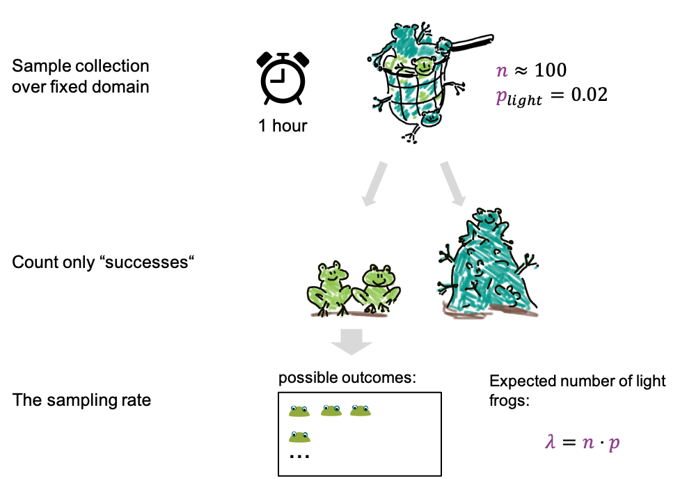
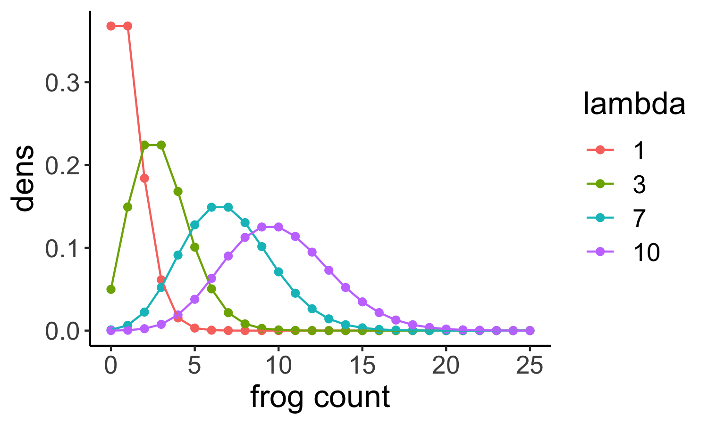

:::::::::::::::::::::::::::::::::::::: questions 

- What is the Poisson distribution?  
- What kind of data is it used on?

::::::::::::::::::::::::::::::::::::::::::::::::

::::::::::::::::::::::::::::::::::::: objectives
- Explain how the Poisson distribution is derived from the binomial.  
- Learn to apply the Poisson distribution in R
::::::::::::::::::::::::::::::::::::::::::::::::


## A special case of the binomial distribution

There is an approximation for the binomial distribution which can often be convenient, specifically if we have 

- many trials (large $n$) and  
- a small success probability $p$.  


{width="700px" alt="frog cartoon demonstrating how the Poisson is derived from the Binomial distribution"}

An example: 

- We now fill the net for 1h, which is for a fixed period of time. 
- We catch about 100 frogs per hour, which means after an hour we have about 100 frogs in the net, and  $n \approx 100$.  
- The fraction of light frogs is low, only 2 % ($p=0.02$).  
- After filling the net, we count only the light ones. 

We can now ask how many light frogs we can expect to catch per hour. This expected number is called $\lambda$, and it's given by  
 $$\lambda = n*p = 100 \cdot 0.02 = 2.$$ 

For the possible outcomes, we again just look at the number of light frogs, we are not interested in the number of dark frogs, or how many frogs we caught in total.
In this scenario **we have reduced the parameters to just one, the rate lambda**, which is the expected number of frogs per hour. And the probabilities of the outcomes can be approximated with a Poisson distribution.


## What is the Poisson used for?

Even though the Poisson is derived as an approximation of the Binomial, we don't necessarily need two categories of events to use it. We can also use it to count events of a single category. 


{width="350px" alt="lake with only one sort of frogs"}

For example, consider a two lakes with frogs of only one colour. We might want to compare the density of frogs in these lakes, which can be done by comparing the Poisson rates. For this, we count frogs within $2 m^2$ regions in both lakes. For each individual lake, this counting process could be described by a Poisson, with the rate giving the average number of frogs per $2 m^2$. 


In general, the poisson describes counting events over a fixed domain, which can be a period of time, or a fixed space. We assume here that events have an underlying rate, called lambda.

Examples:  

- Counting frogs for an hour, or within a defined area of the lake.  
- counting cells or particles in microscopy images within a fixed volume
- counting how many times something happens in the cell within a fixed period of time. 
- Also mutations in the genome can be approximated by Poisson, because the genome has many base pairs, and the fraction of mutated base pairs is low.  

## Properties of the Poisson distribution

The distribution has only one parameter, the rate.  

The probability for counting $k$ events over whatever fixed domain you have chosen is

$$\large P(X=k) = \frac{\color{purple}\lambda^k e^{-\color{purple}\lambda}}{k!} .$$

In the next plot, Poisson distributions for different rates are shown:

<p align="center">

</p>


```{r message=FALSE, echo=FALSE, fig.height=3, include=FALSE}

library(tidyverse)
lambdas <- c(1,3,7,10)
x <- 0:25

df <- data.frame(x=NA, lambda=NA,dens=NA)
for(i in seq_along(lambdas)){
  df <-  df %>% add_row(x=x, lambda = lambdas[i], dens=dpois(x,lambda=lambdas[i]))
}
df$lambda = as.factor(df$lambda)
df <- df[-1,]

ggplot(df, aes(x=x,y=dens, color=lambda)) +
  geom_point() + geom_line()+
  theme_classic()+
  theme(text=element_text(size = 16))+
  labs(x = "frog count")
```


If we look at the shape of the distribution, we see that  

- for low rates, it is clinched towards zero and has long tails towards larger values.
- for larger rates (for example a rate of $10$ shown here in purple) the shape looks more and more like a Gaussian. Indeed, high-valued counts can often be well described with a Gaussian as well.


Another important feature of the Poisson is that its variance and mean are the same, they are both lambda. This means in turn that we can estimate lambda from the sample mean.


::::::::::::::::::::::::: challenge

We are in a diagnostic laboratory that gets blood samples from incoming hospital patients and tests them for some disease. Which of these experiments can be modeled with a Poisson distribution?

1. Counting the number of positive samples out of 50 samples that get tested successively.  
2. Counting the number of samples that test positive within an hour.  
3. Counting the number of samples that get tested within an hour.  

:::::::::::::::::: solution
All of these scenarios can be modeled with a Poisson. Counting the number of positive samples out of 50 is more suitable for a binomial distribution, but can indeed be *approximated* by Poisson.  
::::::::::::::::::::::::::::::::::::::
::::::::::::::::::::::::::::::::::::::
