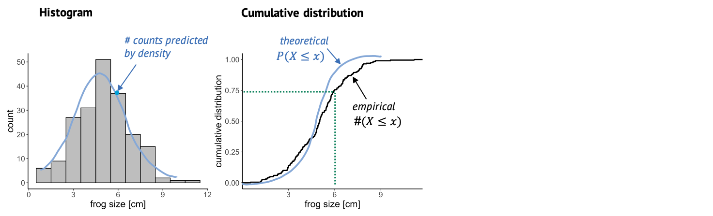

:::::::::::::::::::::::::::::::::::::: questions 

- How can I visualize the distribution of my data?
- How can I find out whether my data is well described by a certain probability distribution?

::::::::::::::::::::::::::::::::::::::::::::::::

::::::::::::::::::::::::::::::::::::: objectives

- Introduce the histogram, ECDF and QQ-plot as tools for comparing an empirical to a theoretical distribution.

::::::::::::::::::::::::::::::::::::::::::::::::

## Tools for visually comparing distributions

Usually, we have some data and want to find the "right" distribution for it. That means, we want to find a distribution that models the data in a suitable way. The workflow should look something like this:  

1. **Fit your data to a distribution that you consider plausible.** We'll see how to do this in R. The fit will give you the best parameters for this distribution, given your data.  
2. **Visually compare the theory to your data points.** The theory in this case is the fit you just obtained. In the visualization, a good fit doesn't show systematic deviations of the data points from theory.  
3. **Do the same with other plausible distributions.**  
4. **Decide which fit looks best to you.** 

In this episode, I'll introduce the most common visualizations for empirical distributions. In the following episodes, we'll see how to produce them in R.

## The histogram

{width="800px" alt="histogram plot"}

Once we have fitted a distribution to the data, we can visually compare the theory, that is the fitted distribution, to the actual data and decide whether this is a good fit.
One very common thing to look at is the histogram. The more data points you have, the more it resembles the underlying probability distribution. So we could look at this histogram here and check whether it looks similar to the Gaussian shape, shown in blue.
A problem about this plot is that, as you might have noticed already, a lot of distributions look roughly bell-shaped. And often it’s difficult to tell subtle differences from a histogram.

## The cumulative distribution

This is why it is also useful to look at the cumulative distribution. 
**For every value $k$, the cumulative distribution gives the percentage of data points that have a smaller value than this $k$.**

{width="800px" alt="histogram and ecdf plot"}

In this case, you can look up a certain frog size, and the graph will tell you what percentage of frogs is smaller than that.
For example, if we look up the size of 6 cm, the cumulative distribution tells us that roughly 75% of the frogs in the sample are smaller than 6 cm.
The empirical cumulative distribution comes from the data, and one little step for each data point. The theoretical distribution gives the percentage of data points that you’d expect to be smaller than a certain value, for the distribution that you are comparing to.
In this graph, it’s often easier to see systematic deviations from the expectation, for example here the blue line is substantially steeper than the black line, so maybe here we are comparing to a theoretical distribution with a too low variance.

## The QQ-plot

Another useful plot is the QQ-plot. It’s very often used for checking whether the data is normal, but it can also be used for comparing to other distributions.

{width="800px" alt="histogram, ecdf, and qq plot"}

Here, we plot sample quantiles against theoretical quantiles. The 25th quantile is the value $k$ at which 25% of the data points are smaller then k. You can determine the quantile for each data point, and compare it to theory, so each point in this plot is a comparison between theory and data.
The nice thing about this plot is that when the theory and data match well, all points end up on a straight line. And it’s easy for our eyes to decide whether something is a straight line or not.

:::::::::::::::::::::: callout
### A note on fitting

When we say we "fit" a distribution, we are usually talking about the *maximum likelihood approach*. This means we find the parameters for which it is most likely to see the given data. This is an optimization problem - and thus can be solved conveniently by the computer. You might also hear people say they *minimize the deviance* when they fit data, and this is just another term for minimizing the distance between the line (theory) and the points (data). The exact mathematical formula for the deviance to be minimized depends on the type of distribution we are fitting to -- for example, when fitting a Gaussian distribution, we minimize the sum of squares. But no worries: The tools for fitting that you'll get to know in this tutorial know their formulae :)
::::::::::::::::::::::::::